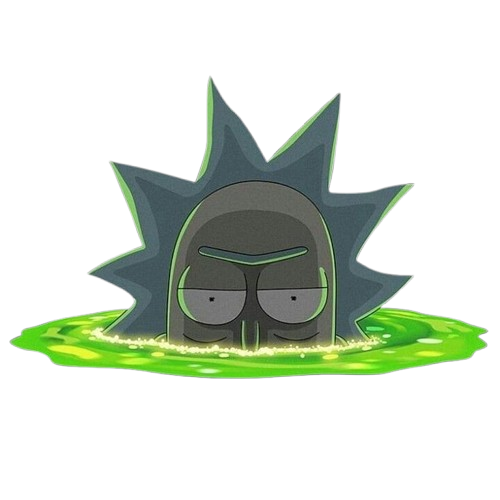

</img>

# Rick and Morty App

Aplicativo Flutter de exemplo para listar personagens do universo "Rick and Morty".

## Visão geral

- Código principal em `lib/` com `lib/main.dart` como ponto de entrada.
- Implementa separação de camadas (modules, data, domain, presentation) para o módulo `personagens` dentro de `lib/app/core/modules`.

## Estrutura do projeto (resumida)

- `lib/main.dart` - ponto de entrada do app.
- `lib/app/app.dart` - configuração principal da aplicação (tema, router, provedores).
- `lib/app/core/modules/personagens/` - feature de personagens com camadas:
  - `data/` - datasources (http/cache), dtos e implementações de repositório
  - `domain/` - entidades, repositórios abstratos e usecases
  - `presentation/` - páginas, viewmodels e componentes UI
- `lib/app/core/shared/` - utilitários, injeção de dependências, cliente HTTP, cache e componentes compartilhados

## Convenções e padrões adotados

- Arquitetura: MVVM / Camadas (Domain, Data, Presentation).
- Injeção de dependências manual centralizada em `lib/app/core/injection/injection.dart`.
- State management: ViewModels (ChangeNotifier/ValueNotifier conforme necessidade) e `ValueListenableBuilder`/`StreamBuilder`/`FutureBuilder`.

## Requisitos

- Flutter SDK (^3.9.2).
- Dart SDK incluído no Flutter.
- VSCode ou editor de prefrência

## Instalação e execução (desenvolvimento)

1. Abra este diretório no terminal.
2. Instale dependências:

```powershell
flutter pub get
```

3. Executar o app em emulador:

```powershell
flutter run
```
